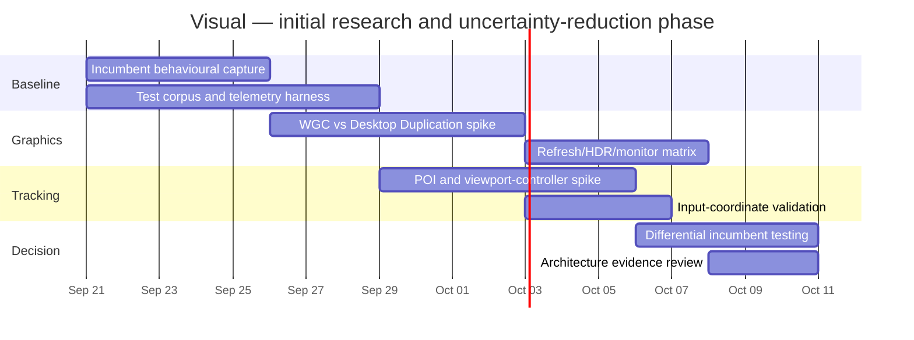
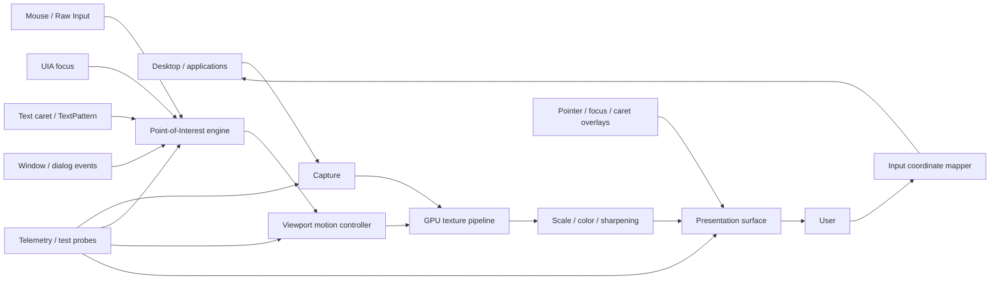
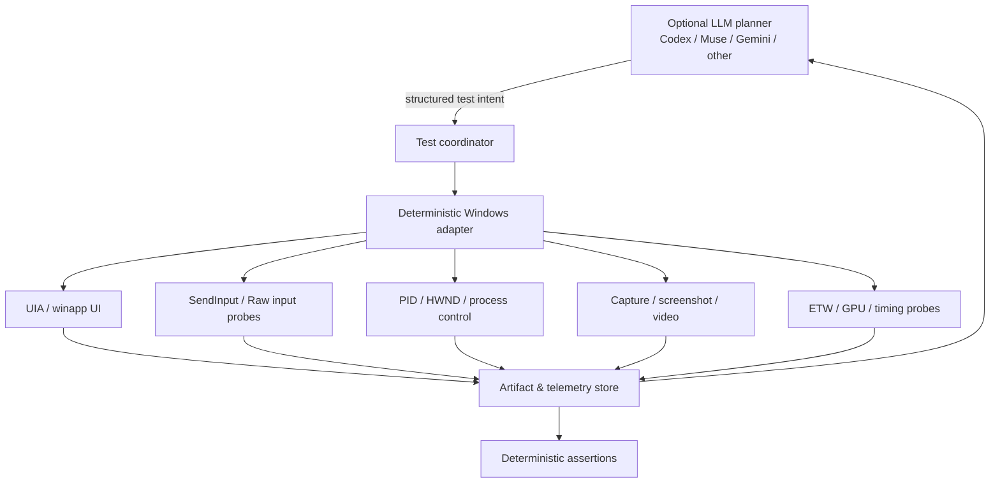
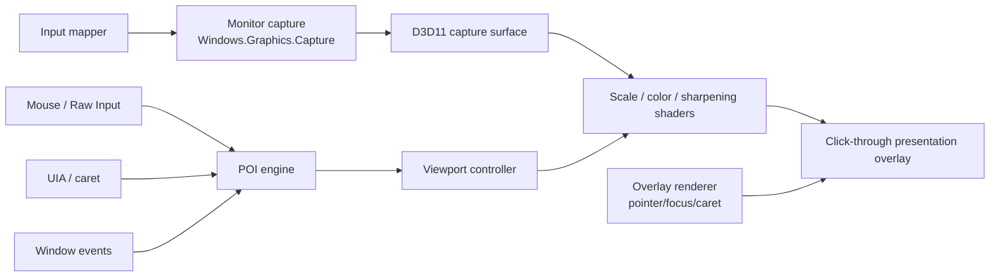
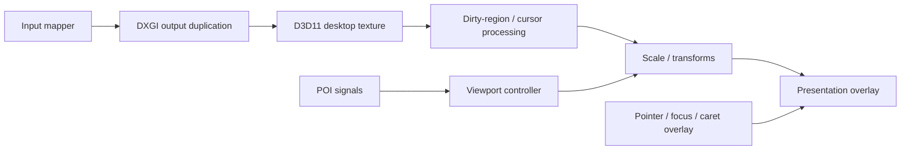
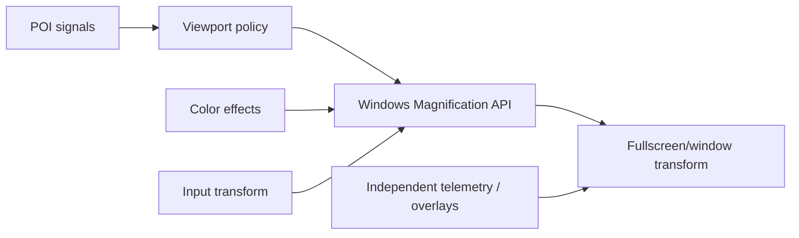

# Visual: Technical Research Baseline for a Modern Windows Low-Vision Magnifier

## Executive assessment and research boundary

The attachment is **not actually unspecified**: it contains a detailed clean-room research brief for **Visual**, a proposed Windows low-vision magnification application. I have therefore treated that attachment as the controlling task rather than inventing a generic market-analysis or literature-review assignment. fileciteturn0file0

**Executive conclusion:** Visual should not begin by trying to reproduce ZoomText or SuperNova feature-for-feature. The technically important problem is a much narrower chain:

> **capture the right pixels → present them with consistently low latency → determine what the user needs to see → move the viewport predictably → preserve correct input semantics → survive Windows/app/display edge cases.**

The first three architectural uncertainties are consequently **capture/presentation**, **Point-of-Interest tracking**, and **coordinate/input correctness**. Text enhancement is strategically important but should come later.

As of September 18, 2026, the incumbent evidence suggests:

- **ZoomText 2026.2608.15** is the latest publicly listed ZoomText build, dated August 17, 2026. During 2026 Freedom Scientific moved its graphics path to an updated “Capture API”, added a Magnification API option aimed at screen sharing, improved Windows 11 graphics compatibility, and made some multi-monitor enhancements independently configurable per display. That history is revealing: even a mature magnifier still has to change graphics backends as Windows evolves. citeturn1search6turn1search15turn1search5
- Dolphin's public material has a **version-source inconsistency**. Official July 22, 2026 pages announce SuperNova 25.04 for Magnifier & Speech and Magnifier & Screen Reader, while Dolphin's Magnifier version-history page still lists 25.03 dated June 1, 2026. That should remain an explicit research uncertainty for the Magnifier-only SKU rather than being silently “resolved.” citeturn11search0turn11search1turn9search1
- Windows Magnifier remains a useful behavioral baseline because Windows itself documents fullscreen, lens and docked modes; mouse, keyboard-focus, text-cursor and Narrator-cursor following; zoom increments; inversion; panning; and extensive keyboard operation. citeturn0search1turn0search2turn24search5
- Neither Microsoft nor the commercial vendors provide public documentation sufficient to prove reliable **120/144 Hz behavior**, mixed-HDR behavior, recursion characteristics, or detailed motion algorithms. Those must be measured rather than inferred.
- The Windows platform provides several credible building blocks, but no single API solves the product. DXGI Desktop Duplication exposes frame, dirty-region and pointer metadata but has explicit reset conditions; Windows.Graphics.Capture provides D3D11 surfaces, compositor timestamps, monitor/window targeting, cursor controls, HDR guidance and newer dirty-region facilities; the Magnification API exposes OS-integrated fullscreen/window transforms, color effects and input transforms. citeturn2search0turn2search14turn16search0turn16search1turn2search1
- **D3D11 is the sensible baseline for experiments, not yet the final architecture.** Windows.Graphics.Capture already gives D3D11 capture surfaces, DirectComposition is natively associated with D3D11/DXGI, and D3D12 deliberately shifts synchronization, residency and resource-management responsibility to the application. Nothing currently demonstrates that Visual's relatively simple scaling/shader pipeline needs that complexity. citeturn16search1turn15search1turn15search16
- The probable **product moat is not pixel scaling**. It is the behavior of the Point-of-Interest and viewport controller: deciding whether mouse, caret, keyboard focus, newly opened dialog, selection or another signal currently represents user intent, then moving enough—but not too much—to expose it.
- Advanced font reconstruction should be a **later commercial capability, not an MVP requirement**. ZoomText's xFont and Dolphin's True Fonts demonstrate user value, but vendor documentation also shows application-specific coverage rather than a universal “make raster text vector again” mechanism. ZoomText xFont has explicitly supported selected Office applications and ZoomText's own surfaces; Dolphin documents True Fonts on the Windows desktop and Office applications. citeturn22search2turn22search3turn24search0
- The behavioral harness should exist **before the serious application architecture**. It should expose deterministic Windows primitives and allow an LLM to decide *what* to test without allowing the model to become the mechanism that performs or measures the test. Microsoft's new `winapp ui` is highly relevant, but it is still part of a public-preview toolchain and should therefore be an adapter, not the only automation foundation. citeturn18search0turn18search1

**Recommended architectural posture:** carry **Windows.Graphics.Capture + D3D11** and **DXGI Desktop Duplication + D3D11** through identical measurement spikes; keep the **Magnification API** as a reference/fallback candidate. Do not pick the winner from API aesthetics.

**Clean-room rule:** public product documentation, ordinary product operation, public Windows APIs and legitimately licensed open source are acceptable evidence. Proprietary source, decompilation and non-public implementation information are excluded. For Wind in particular, anything after v0.6.1/August 31, 2026 must be behavior-only research; its current repository explicitly says those later releases are proprietary while releases through v0.6.1 retain their MIT grant. citeturn22search15

A realistic first research phase is **roughly 20–30 working days for a very small senior team**, dominated by throwaway measurement prototypes rather than application implementation. This estimate assumes machines and incumbent licenses are readily available; driver-matrix testing can expand it substantially.

## Incumbent behavioral landscape

**Evidence notation:** **D** = DOCUMENTED explicitly by a reliable primary source; **R** = OBSERVED/REPORTED through vendor issue documentation or credible external behavior; **U** = UNKNOWN from the evidence collected. “Unknown” does not mean absent.

The matrix deliberately normalizes behaviors instead of adopting vendor marketing taxonomies.

| Capability | ZoomText Magnifier | Dolphin SuperNova | Windows Magnifier |
|---|---|---|---|
| Fullscreen magnification | **D**. Primary mode; starts in Full view at 2× in current getting-started material. citeturn8search4 | **D**. Fullscreen among eight magnifier views. citeturn24search0 | **D**. Fullscreen mode. citeturn0search1turn24search9 |
| Lens/window view | **D** for multiple zoom-window facilities, including separate frozen regions; exact current taxonomy should be recorded behaviorally rather than assumed from older manuals. citeturn8search13 | **D**. Fixed and movable window views. citeturn24search0 | **D**. Floating lens. citeturn24search9 |
| Docked/split view | Current exact ZoomText taxonomy requires behavioral verification | **D**. Half-screen/split arrangements are documented. citeturn24search0turn9search11 | **D**. Docked mode. citeturn0search1turn24search9 |
| Multiple/frozen magnified regions | **D**. Up to four Freeze Views are documented. citeturn8search13 | Hooked Area maps broadly to ZoomText's Freeze Window concept in Dolphin migration material. **D** at functional level. citeturn9search18 | **U** |
| Magnification range | **D: 1.0×–60×**, with fractional/incremental steps between 1× and 5×. citeturn8search4 | **D: 1×–64×**. citeturn24search0 | Adjustable level and configurable increments are **D**; a current Microsoft source retrieved here did not establish the exact maximum, so maximum = **U** rather than relying on third-party claims. citeturn24search5turn24search7 |
| Smooth zoom | **U** from primary documentation reviewed | **U** | **U** |
| Smooth panning | **D**. Sensitivity determines which movement distances are smoothed. citeturn8search3turn22search8 | Panning is **D**; exact smoothing/motion law = **U**. citeturn9search11 | Panning controls are **D**; motion law = **U**. citeturn0search2 |
| Mouse tracking | **D**. citeturn8search4 | **D**. citeturn24search0 | **D**. citeturn0search1 |
| Keyboard-focus/application-navigation tracking | **D** at behavioral level. citeturn8search4 | Cursor/focus behavior is documented, but exact signal hierarchy = **U**. citeturn24search0turn9search18 | **D**. Keyboard focus can be followed. citeturn0search1 |
| Text-caret tracking | **D**. Typing is explicitly kept in view. citeturn8search4 | **D** at cursor-tracking level. citeturn24search0 | **D**. Text cursor can be followed separately. citeturn0search1 |
| Menus/dialogs | Broad application-navigation following is **D**; precise behavior = **U**. citeturn8search4 | **U** at algorithmic level | **U** beyond keyboard-focus tracking |
| Pointer enhancement | **D**, including explicit enhancement toggle. citeturn8search0turn8search7 | **D**, 200 high-visibility pointer choices, fixed or magnification-scaled. citeturn24search0 | No comparable enhancement established in retrieved primary evidence: **U** |
| Caret enhancement | **D**. citeturn8search0turn8search7 | **D** through cursor highlighting. citeturn9search18turn24search0 | **U** as a visual enhancement |
| Focus enhancement | **D**. citeturn8search0turn8search7 | **D**. citeturn24search0 | Tracking = **D**; dedicated focus enhancement = **U** |
| Color transformations | **D**, including color enhancement and Smart Invert. citeturn8search0 | **D**, 24 presets plus custom schemes. citeturn24search0 | **D** for inversion. citeturn0search1 |
| Contrast/brightness | ZoomText color-enhancement system exists; exact current control dimensions need cataloging | Custom schemes documented; exact parameter set needs cataloging. citeturn24search0 | **U** within Magnifier itself |
| Font/text smoothing | **D**. xFont now covers selected ZoomText UI and Office applications; coverage has expanded over releases. citeturn22search2turn22search3 | **D**. True Fonts, with documented Windows desktop and Office coverage. citeturn24search0turn10search2 | **U** beyond normal Windows rendering |
| Image smoothing/sharpening | A general smoothing mode is **D**; precise image algorithm = **U**. citeturn22search10 | **D** image sharpening. citeturn24search0 | **U** |
| Multi-monitor behavior | **D**. Single Desktop mode and 2026 per-display enhancement controls are documented. citeturn8search8turn1search5 | **D**, unusually rich: spanning, independent per-display settings, cloning, presentation behavior and inter-monitor pointer controls. citeturn9search0 | Basic OS multi-display operation is plausible but detailed behavior was not established by the current primary material reviewed: **U** |
| Mixed DPI/scaling | **U** as a documented guarantee | **R** risk: Dolphin documented 4K/WGC panning ghost artifacts in 2026. citeturn24search13 | **U** |
| 60 Hz operation | Normal operation implicitly expected; no quantitative guarantee | Same | Same |
| 120/144 Hz | **U** | **U** | **U** |
| HDR | **U** | **U** | **U** |
| General app compatibility | Continuous vendor maintenance is **D**; Chrome-specific fixes show that compatibility remains app/version dependent. citeturn8search16turn1search5 | Continuous fixes are **D**; 2026 releases include Chrome, Windows Settings, 4K and Office work. citeturn10search2 | Broad Windows baseline, but no universal compatibility guarantee |
| Fullscreen games | **U** from retrieved official ZoomText sources | **U** | **U** |
| Keyboard operation | **D**, extensive layered/hotkey scheme. citeturn8search0turn22search10 | **D**, extensive zoom/view/pan scheme. citeturn9search11 | **D**. citeturn0search2 |
| Settings/persistence | **D** through product configuration | **D** through control panel/configuration | **D** through Windows Accessibility settings. citeturn24search5 |
| Accessibility interaction | Explicit low-vision product; app-navigation tracking is **D**. citeturn8search4 | Explicit low-vision product; Magnifier & Screen Reader/Speech variants integrate additional accessibility functions. citeturn24search0 | **D** integration with Narrator cursor. citeturn0search1 |
| Application-specific adaptations | **D**: xFont application coverage and Chrome fixes are concrete examples. citeturn22search2turn8search16 | **D**: Office True Fonts and Chrome/Office-specific fixes. citeturn24search0turn10search2 | **U** at comparable vendor-patch level |

Two observations matter more than the feature count.

First, **all three systems track several conceptually different things**. Microsoft exposes independent choices for mouse pointer, keyboard focus, text cursor and Narrator cursor; ZoomText explicitly follows mouse, typing and application navigation. That strongly supports designing Visual around independent signals rather than a single “follow focus” mechanism. citeturn0search1turn8search4

Second, commercial maturity has **not eliminated graphics compatibility failures**. ZoomText changed graphics behavior during 2026 to improve Windows compatibility, while Dolphin documented a WGC-specific 4K ghosting problem and supplied an alternative magnification engine as a workaround. This is good evidence for a layered/fallback architecture, not for assuming any one capture API will be universally reliable. citeturn1search5turn24search13turn9search8

Multi-display behavior is a more credible differentiation direction than simply accumulating enhancement checkboxes. SuperNova already offers independent per-monitor settings and presentation-oriented workflows, while ZoomText has Single Desktop and per-display enhancement behavior. Visual therefore needs to go beyond “supports two monitors” if this is to become differentiation: think **overview/detail roles, deliberate monitor handoff, stable context while the Point-of-Interest moves, and independent semantic purpose per display**. citeturn9search0turn8search8turn1search5

## Technical subsystem and Windows API map

The product is best decomposed into a pipeline with deliberately separable policy and mechanism:

| Subsystem | Difficulty | Primary Windows mechanisms | Likely failure modes | Engineering or moat? |
|---|---:|---|---|---|
| Screen capture | High | WGC; DXGI Desktop Duplication; Magnification API where appropriate. citeturn2search0turn16search1turn2search1 | Missing/protected frames, mode changes, recursion, capture reset, HDR mismatch, adapter mismatch | Mostly engineering, but compatibility layer matters commercially |
| GPU scaling/rendering | Medium | D3D11 baseline; shaders; composition/presentation | frame queues, synchronization, filtering artifacts, GPU copies | Commodity unless unusual image-quality techniques emerge |
| Viewport positioning | Medium | Own geometry/controller | edge clamping, jitter, stale POI, impossible centering near desktop edges | **Moat-adjacent** |
| Mouse tracking | Low–Medium | Cursor APIs plus Raw Input | hidden/locked cursors, high-rate mice, cross-monitor coordinates | Commodity until games/locked-pointer cases |
| Keyboard-focus tracking | Medium | UIA focus events/GetFocusedElement. citeturn17search0turn17search5turn17search13 | stale elements, custom controls, event storms | Compatibility engineering |
| Text-caret tracking | **High** | TextPattern/TextPattern2, `GetCaretRange`; `GUITHREADINFO` fallback. citeturn3search2turn3search0turn3search1 | no provider, wrong rectangle, logical/physical coordinate confusion, offscreen caret | **Possible moat** |
| Point-of-Interest selection | **Very high** | Own policy over multiple signals | signal fights, distracting jumps, wrong priority | **Core moat** |
| Panning/motion model | High | Own controller + high-resolution timing | nausea, lag, overshoot, micro-jitter, slow long jumps | **Core moat** |
| Pointer/focus/caret overlays | Medium | D3D/composition overlay | cursor duplication, bad z-order, recursion, DPI mismatch | Mostly engineering |
| Color transforms | Low | GPU shader; Magnification color effects as reference. citeturn2search1 | HDR/color-space mistakes, inversion of own overlays | Commodity |
| Text-quality improvement | **Very high** beyond basic filters | shader filtering; DirectWrite for semantic rerender | blur/halos; wrong font/layout; inaccessible semantics | **Potential later moat** |
| Multi-monitor/DPI/HDR | **Very high** | monitor topology, DPI-aware Win32, WGC/DD, DXGI formats | discontinuous coordinates, mixed scaling/refresh/HDR, GPU ownership | **Commercial differentiator** |
| Settings/control UI | Low–Medium | WinUI 3/Windows App SDK | focus stealing, accessibility of Visual's own UI | Commodity |
| Input mapping while zoomed | High | own transforms; Magnification API `MagSetInputTransform` as reference | clicks land in wrong location, DPI rounding, elevation/UIPI | Product-critical engineering |
| Compatibility/fallback layer | **Very high** | multiple capture/tracking strategies | behavior differs by app/driver/Windows update | **Commercial moat through breadth** |
| Automated behavioral testing | High initially | UIA, winapp UI, SendInput, video/telemetry | non-deterministic apps, privilege boundary, timing noise | **Strategic project asset** |

Microsoft's Magnification API is particularly useful as a **behavioral reference and possible fallback**, not automatically as the core architecture. It provides fullscreen transforms, window-source transforms, color effects, cursor control and an input transform. `MagSetInputTransform` maps magnified coordinates back to the unmagnified desktop, but Microsoft documents UIAccess requirements; the old Microsoft sample also has limitations, including a windowed example that does not support multiple monitors. citeturn2search12turn2search18turn4search2turn4search4

### Capture and rendering candidates

| Technology | Strengths relevant to Visual | Important limitations / unknowns | Research judgement |
|---|---|---|---|
| **DXGI Desktop Duplication** | Per-output desktop frames; explicit pointer metadata; dirty/move-region support; direct GPU workflow. citeturn2search0turn2search7turn2search14 | Output-oriented rather than semantic/window-oriented; rotation handling is caller's responsibility; duplication can be invalidated on desktop/mode/DWM transitions; protected content can be masked. citeturn2search0turn2search7turn2search14 | **Leading experimental candidate** |
| **Windows.Graphics.Capture** | D3D11 surfaces; compositor-relative frame timestamps; HWND/HMONITOR interop; selectable cursor capture; newer builds expose dirty regions and update controls; Microsoft gives explicit HDR guidance. citeturn16search0turn16search1turn16search2turn2search15 | OS/version differences must be tested; capture-border/permission behavior needs correct configuration; recursion and ultra-high-refresh behavior are not proven by docs | **Leading experimental candidate** |
| **Windows Magnification API** | OS-integrated fullscreen/window transformations, color effects and input coordinate mapping. citeturn2search1turn2search18 | Less control over pipeline; old sample constraints; overview docs are from an older API family; difficult to treat as a differentiated graphics engine | **Reference/fallback candidate** |
| **Direct DWM “desktop transform”** | Conceptually attractive | There is no documented general-purpose public DWM API in the reviewed evidence that should be assumed to let an ordinary app arbitrarily transform the entire desktop. DirectComposition composes an application's bitmap content; it is not a desktop-capture API. citeturn15search11 | **Do not build around undocumented compositor behavior** |
| **Direct3D 11** | Natural fit with WGC D3D11 surfaces, DXGI and straightforward texture/shader scaling | Higher-level driver model offers less explicit scheduling than D3D12 | **Baseline renderer** |
| **Direct3D 12** | Explicit scheduling/resource control could matter if profiling eventually proves D3D11 overhead or advanced compute requirements | Considerably more synchronization, residency and descriptor management responsibility. citeturn15search16turn15search18 | **No demonstrated MVP advantage yet** |
| **DirectComposition** | Efficient OS composition of application visuals; D3D11/DXGI integration | Not capture; Microsoft itself recommends the newer Windows visual-layer APIs for modern apps. citeturn15search0turn15search1 | Presentation experiment, not capture strategy |
| **DirectWrite** | Resolution-independent text layout, subpixel positioning and modes optimized for large glyph sizes/outlines. citeturn15search6turn15search19 | Requires text/layout semantics; cannot magically reconstruct arbitrary pixels | Future semantic-text component |

**HDR is one area where WGC has unusually useful public guidance.** Microsoft advises an `R16G16B16A16_FLOAT` pipeline when capturing HDR content to avoid washed-out/clipped results, with tone mapping if the output is SDR. Visual should make this part of the first capture benchmark instead of bolting HDR on at the end. citeturn2search15

**Protected content must be treated as a normal boundary condition.** Desktop Duplication explicitly reports when protected content has been masked out. A commercial magnifier cannot promise to defeat OS/content-protection restrictions; its correct behavior is to fail safely, identify the condition when possible, and use only legitimate supported fallbacks. citeturn2search7

**Refresh-rate feasibility:** nothing in the documentation justifies claiming 120 or 144 Hz merely because a D3D pipeline is fast enough. WGC supplies compositor timestamps and now exposes update/dirty-region mechanisms; Desktop Duplication exposes frame metadata. Those give us instrumentation, not a guarantee. citeturn16search0turn16search1turn2search14

The decisive experiment should therefore compare identical renderers behind interchangeable capture adapters:

| Benchmark variable | Required matrix |
|---|---|
| Capture | WGC, Desktop Duplication; Magnification API as reference |
| Zoom | 1× passthrough, 2×, 4×, 8× |
| Refresh | 60, 120 and 144 Hz where hardware supports them |
| GPUs | Intel integrated; AMD discrete; NVIDIA discrete; one hybrid-GPU laptop |
| Displays | one monitor; two monitors; mixed refresh; mixed DPI; monitor hot-plug |
| Color | SDR; HDR display; HDR source→SDR output |
| Workload | static text, rapid scrolling, video, window drag, text typing, 1000 Hz mouse, browser animation |
| Metrics | capture age, present latency, P50/P95/P99 frame interval, dropped/stale frames, GPU time, copies/frame, CPU%, VRAM, topology recovery time |
| Failure probes | protected video, lock/unlock, UAC boundary, display-mode switch, full-screen/borderless application, sleep/resume, GPU-driver reset where safe |
| Recursion probe | Visual-style overlay positioned over captured output; establish whether/how each path sees its own output |

For end-to-end latency, software timestamps alone are insufficient. Pair ETW/timing markers with a **high-speed camera or photodiode-style visible stimulus** so input-to-photon behavior can be independently checked.

## Tracking, text quality, and open-source provenance

The Point-of-Interest engine should be regarded as a separate product subsystem, not as a few `if` statements attached to the renderer.

Windows supplies genuinely different signals:

- UI Automation focus events identify the element receiving keyboard focus, and the focused element can also be queried explicitly. citeturn17search0turn17search5turn17search13
- `TextPattern2::GetCaretRange` can expose a zero-length range at the caret; its range can then be used to obtain positional information. citeturn3search2
- `GetGUIThreadInfo` exposes active/focus/menu/caret window information and a caret rectangle, but Microsoft's documentation makes coordinate interpretation and transition conditions important. citeturn3search0turn3search1
- Raw Input provides direct high-rate device events; Microsoft's March 2026 documentation specifically discusses buffered operation for devices such as 1000 Hz mice. citeturn17search6turn17search9

A useful conceptual model is:

| User evidence | Default POI policy |
|---|---|
| Significant physical mouse motion | Pointer gains priority |
| Typing activity plus valid caret | Caret gains priority |
| Tab/arrows/control navigation | UIA focus gains priority |
| New modal dialog/menu associated with active process | Newly active object receives transient priority |
| Selection extension | Active end of selection is candidate POI |
| Application/window activation | Focus/first meaningful object reacquired |
| No reliable semantic signal | Pointer/window geometry fallback; OCR only as a last research fallback |

The crucial design is **not** the priority list; it is *temporal arbitration*. A better model is to assign every signal a confidence, intent weight, geometry and expiry. Conceptually:

`POI score = signal confidence × inferred-intent weight × recency × continuity`

That lets the viewport controller implement these behaviors independently:

- **Dead zone:** do not move while the active point remains comfortably visible.
- **Inner margin:** begin correction before a caret actually touches the viewport edge.
- **Hysteresis:** use different thresholds for entering and leaving tracking states, preventing rapid mouse/caret fights.
- **Minimum displacement:** ignore sub-pixel and small geometry noise.
- **Motion duration cap:** long moves should not turn into slow cinematic pans.
- **Inertia selectively:** useful for continuous pan, dangerous for caret correction.
- **Edge policy:** do not insist on centering when desktop geometry makes centering impossible.
- **Conflict lockout:** immediately after a keystroke, a tiny mouse sensor movement should not steal the viewport from the caret.
- **Intent timeout:** once typing stops, caret priority decays rather than remaining permanently dominant.
- **Jump classification:** a newly opened modal dialog is a different event from a caret advancing by one glyph.

ZoomText's own public smooth-panning behavior validates the importance of movement thresholds: Freedom Scientific documents different behavior for small and large focus movements and user-adjustable sensitivity. citeturn22search8

**Framework-risk map — an engineering hypothesis to test, not a claim of universal behavior:**

| Application family | First signal path | Main research concern |
|---|---|---|
| Native Win32 | UIA + `GUITHREADINFO` | owner-drawn/custom controls; legacy system caret |
| WPF | UIA/TextPattern | virtualized controls and custom editors |
| WinUI | UIA | rapidly changing or custom visual trees |
| Office | UIA/TextPattern + app-specific regression corpus | highly specialized editors and document geometry |
| Chromium/Edge/Chrome | UIA accessibility tree | version-dependent browser behavior and editable-web content |
| Electron | Chromium UIA path | app-specific accessibility quality |
| Firefox/other browsers | UIA/TextPattern where exposed | content vs browser chrome distinction |
| Java | accessibility/UIA bridge where available | provider availability and coordinate reliability |
| Games/custom engines | pointer/Raw Input/window geometry | often no useful semantic accessibility tree |

This compatibility concern is not theoretical. Both Freedom Scientific and Dolphin have shipped Chrome-specific fixes, while Dolphin has also shipped Windows Settings and Office-specific compatibility changes. citeturn8search16turn10search2

**Text-quality assessment.** At high magnification, ordinary raster enlargement necessarily magnifies the already rasterized glyph image. Bilinear/bicubic filtering can alter blur/alias trade-offs and sharpening can restore local contrast, but none of them recovers the original font outline or shaping information. DirectWrite, by contrast, has resolution-independent natural layout, sub-pixel glyph positioning, symmetric antialiasing intended to improve curves at larger sizes, and an outline mode intended for very large sizes. citeturn15search6turn15search19

That creates three practical text strategies:

| Strategy | Value | Limitation | Product phase |
|---|---|---|---|
| GPU scaling + carefully tuned filter/sharpen | Universal, low latency | cannot restore lost glyph geometry | **Prototype/MVP** |
| Separate semantic “clear text” presentation | Can use accessible text without pretending to reproduce exact original layout | separate from original UI | **MVP/later candidate** |
| Selective in-place semantic rerender via UIA + DirectWrite | Potentially excellent text | font/style/layout/range mapping is extraordinarily hard and inconsistent across apps | **Later commercial research** |

ZoomText itself now includes a separate **Live Text View**, which displays high-contrast text in a distinct view; that is notable because it demonstrates that not every text-quality problem has to be solved by reconstructing the exact underlying pixels. citeturn8search11

For proprietary incumbent font systems, the only defensible conclusion is behavioral. Freedom Scientific says xFont provides clearer font rendering in selected ZoomText surfaces and Microsoft 365 applications and has expanded its coverage over time. Dolphin says True Fonts keeps text sharp/smooth and documents Windows desktop plus Office coverage. Neither source justifies inferring the proprietary algorithm. citeturn22search2turn24search0

**Recommendation: semantic rerendering is not an MVP requirement.** The first product must prove it can follow the right thing with low latency and without making the user seasick. Beautifully reconstructed text attached to the wrong viewport is merely an expensive way of being wrong.

### Open-source and reusable landscape

| Project | What it is / status | Architecture or useful ideas | License evidence | Reuse decision |
|---|---|---|---|---|
| **Wind ≤ v0.6.1 / Aug 31, 2026** | Windows fullscreen magnifier; historical release line | Potentially useful magnifier implementation reference, **but architecture must be examined from the actual historical snapshot rather than projected backwards from current code** | Current primary repository explicitly says releases through v0.6.1 were MIT and that grant remains valid. citeturn22search15 | **BORROW only after provenance verification**: archive exact tag/commit and its license |
| **Wind > v0.6.1** | Current active line | Public behavior can inform testing; implementation must not enter Visual's clean-room corpus | Proprietary/all rights reserved after Aug 31, 2026. citeturn22search15 | **STUDY behavior only; IGNORE code/architecture** |
| **HoverText** | Windows accessibility utility; relatively early project | WPF/.NET 8; UIA-first text extraction, optional OCR and pixel magnification; multiple screenshot/capture backends; useful ideas for fallbacks/testing | MIT in primary repository. citeturn7view3 | **STUDY; selectively BORROW isolated MIT components after review** |
| **ZoomLens 1.1 Beta** | Portable Windows lens/separate-window utility | Cursor following, monitor selection, standard Windows windowing/magnification APIs; known fullscreen/DPI/topology limitations | Repository view retrieved did **not surface a source-code license**, and the listed files are mainly documentation/assets rather than a clearly reusable source tree. citeturn22search1 | **STUDY behavior; do not reuse code absent explicit license** |
| **Magnifier+** | Small native Windows magnifier | C++, Windows Magnification API/GDI, configurable 1–5× and 60 FPS target | MIT. citeturn22search4 | **STUDY / BORROW small reference pieces after audit** |
| **Microsoft Magnification sample** | Official reference sample | Fullscreen/windowed Magnification API and input-transform examples | Official Microsoft sample; exact redistribution terms should be captured with the source snapshot before copying | **STUDY first**. citeturn4search2turn4search4 |
| **OpenZoom** | Low-vision live-video/camera magnifier rather than full desktop magnifier | D3D12/CUDA image-processing ideas, sharpening/stabilization | GPL-3.0-only with §7 exception plus separate commercial licensing. citeturn22search6 | **STUDY algorithms/concepts only** unless licensing strategy changes |
| **UIA navigation utilities such as hunt-n-peck** | Accessibility/navigation tooling | UIA tree enumeration and element geometry can inform research harness ideas | License must be pinned before reuse | **STUDY**, not core magnifier architecture |

The most important provenance rule is simple: **“available on GitHub” is not equivalent to “reusable.”** Every borrowed component should carry a provenance record containing repository, exact commit/tag, retrieval date, license file hash, copied files, modifications and dependency licenses.

For Wind, maintain physically separate research directories:

`wind-mit-through-v0.6.1/` — eligible for licensed code review after tag/license verification.

`wind-post-2026-08-31-behavior-only/` — screenshots, public release notes and black-box observations only; no implementation material.

That separation is worth being pedantic about. Intellectual-property hygiene is much cheaper now than during due diligence.

## Behavioral research harness and differential test suite

The automation architecture should make an LLM **replaceable**:

Microsoft's `winapp ui`, documented in 2026, already provides command-line inspection and interaction over UI Automation across Win32, WPF, WinForms, Electron and WinUI 3. Most actions use UIA patterns; mouse, touch, pen and key operations can fall back to synthesized physical-style input. Because the overall WinApp CLI is explicitly marked **Public Preview**, Visual should wrap it behind its own interface instead of coupling the test corpus directly to its command syntax. citeturn18search0turn18search1turn18search4

The harness API should expose approximately these primitives:

| Primitive | Deterministic responsibility |
|---|---|
| `observe` | compact current state: process/window/focus/caret/viewport/zoom |
| `screenshot` | timestamped raw frame/screen image |
| `inspect_ui` | bounded UIA tree snapshot |
| `find_element` | deterministic UIA selector/query |
| `click` | UIA invocation where semantically appropriate, physical mouse otherwise |
| `type` | deterministic text/keyboard injection |
| `keypress` | physical-style key sequence |
| `scroll` | wheel/scroll action with recorded delta |
| `get_focus` | UIA focused element + geometry |
| `get_caret` | TextPattern2, Win32 fallback and provenance of result |
| `get_window` | PID/HWND/bounds/DPI/monitor/z-order metadata |
| `record_video` | synchronized test evidence |
| `collect_metrics` | viewport, POI, capture/present timestamps, CPU/GPU and event markers |

`SendInput` is suitable for deterministic keyboard/mouse actions but has a material security boundary: Microsoft documents that UIPI allows injection only into processes at equal or lower integrity, and failures caused by UIPI are not necessarily clearly reported as such. Elevated-application tests therefore need a controlled privilege strategy rather than mysterious flaky failures. citeturn17search1turn17search7

OCR should be **last fallback**, not the normal observation path. OCR converts a deterministic UI geometry problem into a probabilistic vision problem; it is useful precisely when UIA and caret providers fail, not because it is convenient.

The LLM layer should receive screenshots, UI snapshots and metrics and decide which deterministic operation comes next. It should not directly move the pointer and then tell us whether the result “looked right.”

Model choice can stay operational rather than architectural:

- **Muse Spark 1.3** is a reasonable experimental planner because Meta currently describes it as designed for long-horizon agentic/coding work with multimodal perception and exposes computer-use tooling. citeturn21search0turn21search2
- **OpenAI Codex** is suitable for orchestrating engineering/test workflows; the Codex application became available on Windows in March 2026, and OpenAI's September 10, 2026 Agents API exposes the Codex harness for tool-using agents. Neither fact is a reason to bind Visual's test protocol to Codex. citeturn19search5turn19search1
- **Gemini** is likewise suitable for experimentation: Google's current Computer Use documentation supports desktop, browser and mobile environments, with the client responsible for executing generated actions. citeturn20search4

The correct competitive test is therefore not “which model is smartest?” It is “can different planners drive the **same deterministic harness** and reproduce the same experimental procedure?”

### Initial behavioral corpus

Below are **50 initial tests**. ★ marks tests with unusually high architectural information value.

| Area | Five initial tests | Primary measurements |
|---|---|---|
| **Capture / presentation** | **C01★** static desktop at 2×; **C02★** rapid full-window scroll at 4×; **C03** 60 fps video; **C04★** drag window continuously across source region; **C05★** toggle application/borderless fullscreen | frame age; dropped/stale frames; tearing; black frames; recovery |
| **Zoom behavior** | **Z01** 1×→2×; **Z02** 2×→4×; **Z03** repeated in/out sequence; **Z04** minimum/fractional step behavior; **Z05** zoom near desktop edge | anchor point, zoom transition time, viewport displacement, interpolation |
| **Mouse and input mapping** | **M01★** slow pointer to viewport edge; **M02★** 1000 Hz rapid movement; **M03** click target at each corner; **M04★** drag while magnified; **M05★** cross-monitor pointer movement | pointer/viewport lag, dead zone, click-coordinate error, discontinuities |
| **Keyboard focus** | **F01★** Tab through Settings controls; **F02** Shift+Tab reverse; **F03** arrow through list; **F04** ribbon/menu navigation; **F05★** focus jump between distant controls | focused rect, movement trigger threshold, final margin, duration |
| **Text caret** | **T01★** Word long-line typing; **T02★** Notepad long-line typing; **T03** multiline vertical caret; **T04★** browser contenteditable field; **T05** Home/End/Page navigation | caret geometry, trigger margin, viewport velocity, missed caret events |
| **Menus/dialogs/window changes** | **D01★** open modal dialog; **D02** nested menu; **D03** context menu near edge; **D04★** Alt+Tab to distant window; **D05** transient notification/popover | which object wins POI, acquisition delay, unwanted jumps |
| **POI conflict / motion** | **P01★** type while mouse jitters; **P02★** move mouse immediately after typing; **P03** keyboard focus then pointer motion; **P04★** tiny repeated caret movements; **P05★** huge focus jump across screen | arbitration, hysteresis, minimum move, long-jump policy, stability |
| **Display topology** | **X01★** 100%→150% DPI crossing; **X02★** 60→144 Hz crossing; **X03** landscape→portrait monitor; **X04★** unplug/replug secondary display; **X05★** HDR/SDR monitor crossing | coordinate accuracy, capture restart, frame pacing, color correctness |
| **Compatibility / adverse graphics** | **A01★** protected video; **A02** Chrome/Electron editable content; **A03** Office ribbon+document; **A04★** borderless game/custom renderer; **A05★** lock/unlock or display-mode change | graceful failure, black regions, recovery time, semantic fallback |
| **Persistence / resilience / accessibility** | **R01** restart with saved zoom; **R02** crash/relaunch state; **R03★** Visual UI opened over magnification; **R04** Narrator + magnifier interaction; **R05★** elevated target/UIPI boundary | persistence, recursion, focus stealing, accessibility conflict, privilege errors |

Each test should be represented as data rather than prose:

`environment → initial state → actions → expected observables → measured metrics → artifacts → verdict`

For the Word example in the brief, do not merely record that “the view followed the caret.” Record at least:

- viewport X/Y per frame;
- caret rectangle per observation;
- first frame at which movement begins;
- distance from caret to viewport edge at trigger;
- velocity curve;
- movement duration;
- final caret margin;
- overshoot/reversal;
- number of post-movement corrections during the next 500–1,000 ms.

This allows a behavioral signature to be compared across ZoomText, SuperNova, Windows Magnifier and eventually Visual without guessing how any incumbent implements it internally.

The **highest-value first dozen tests** are C02, C04, C05, M01, M04, F01, F05, T01, T04, P01, X01 and X04. Together they answer most of the early architectural questions about capture stability, coordinates, semantic tracking and viewport policy.

For GPU diagnostics, Visual should rely primarily on ETW/WPA-style system instrumentation for end-to-end timing and use PIX selectively. Current PIX is principally a D3D12 analysis tool; Microsoft documents D3D11 capture through an 11-on-12 path, and `pixtool` can automate capture analysis and CSV/resource extraction. The current recommended main PIX build is 2603.25, with 2606.18 as a preview branch. citeturn23search2turn23search8turn23search1turn23search3

## Architecture candidates, development stack, and product program

There is not enough evidence to select the final architecture. Three candidates deserve throwaway prototypes.

**Candidate A — Windows.Graphics.Capture + D3D11 + independent POI engine**

**Advantages:** modern capture API; direct D3D11 surfaces; HWND/HMONITOR targeting; compositor timestamps; cursor capture control; explicit Microsoft HDR guidance; newer dirty-region/update controls. citeturn16search0turn16search1turn16search2turn2search15

**Weaknesses:** the capture pipeline remains compositor-dependent; recursion, high-refresh behavior, monitor-topology transitions and some full-screen workloads must be measured. Dolphin's 2026 4K ghosting issue explicitly involved its WGC engine, so “modern API” must not be confused with “problem-free API.” citeturn24search13

**Likely ceiling:** potentially commercial-quality if latency, recursion and cross-monitor behavior benchmark well.

**Required prototype:** fixed fullscreen 2×/4× magnification on one monitor, deterministic moving test pattern, latency telemetry, HDR/SDR check, overlay recursion probe, 60/120/144 Hz test.

**Candidate B — DXGI Desktop Duplication + D3D11 + independent POI engine**

**Advantages:** explicit output-oriented desktop model; dirty/move information and pointer metadata; low-level control useful for measurement and multi-monitor experimentation. citeturn2search0turn2search7turn2search14

**Weaknesses:** each output has to be managed carefully; rotation is the application's responsibility; output duplication is invalidated by several desktop/display transitions and must be recreated; protected content can be masked. citeturn2search0turn2search7turn2search14

**Likely ceiling:** potentially excellent for tightly controlled desktop magnification, but the compatibility burden may become larger than WGC.

**Required prototype:** identical executable behavior and instrumentation to Candidate A so comparisons are meaningful rather than two teams benchmarking two different applications.

**Candidate C — Magnification API core/reference with native tracking around it**

**Advantages:** Windows supplies transformation and input-mapping primitives; fastest route to a reference prototype; useful fallback experiment. citeturn2search1turn2search18

**Weaknesses:** less control over capture/render quality and timing; older API lineage; sample limitations; uncertain ceiling for sophisticated multi-display/presentation behavior.

**Likely ceiling:** probably lower differentiation and observability than an explicit GPU pipeline, but this is an inference requiring measurement rather than a foregone conclusion.

**Required prototype:** reproduce the same zoom/movement/input tests as A/B and quantify where behavior can no longer be controlled.

A separate “DWM hack” architecture is **not** recommended. Public DirectComposition documentation describes composition of bitmap content supplied to an application's visual tree, not a supported mechanism to commandeer the desktop compositor. Building the company's core technology on undocumented compositor behavior would manufacture risk rather than remove it. citeturn15search11turn15search0

### Development toolchain

For the Windows 11 x64 first target:

| Layer | Recommendation | Rationale |
|---|---|---|
| Core language | **Modern C++** | DirectX, DXGI, Win32/UIA and low-level timing are first-class |
| WinRT interop | **C++/WinRT** | Natural access to Windows.Graphics.Capture and Windows App SDK APIs |
| Renderer | **D3D11 first** | Lowest unnecessary complexity among credible candidates |
| Build | **CMake**, version-pinned | Keeps core graphics/test components independent of IDE project state |
| IDE/compiler | **Visual Studio 2026 / MSVC** | Current Microsoft-native stack; VS 2026 18.10 shipped September 8, 2026. citeturn14search1 |
| Configuration UI | **WinUI 3** | Native modern Windows UI; Windows App SDK 2.4.0 was released August 13, 2026. citeturn13search14 |
| C# | Selective only | Sensible for non-latency-critical auxiliary tooling if it reduces effort; not necessary in the render loop |
| Research harness | **Python** | rapid telemetry analysis, test orchestration, plots and artifact processing |
| Machine/setup scripts | **PowerShell** | native Windows environment/configuration automation |
| System performance | ETW/WPR/WPA | end-to-end CPU/GPU/input/present correlation |
| GPU debugging | PIX selectively + D3D debug layer | especially if D3D12 is later tested; current PIX tooling supports automated analysis and D3D11-over-12 capture paths. citeturn23search1turn23search8 |
| UI automation | Own abstraction over UIA + `winapp ui` adapter | model-independent and resilient to preview CLI changes. citeturn18search1 |
| Unit/integration tests | native C++ tests + Python behavioral runner | separate deterministic algorithm tests from system behavior |

Cross-platform UI frameworks are hard to justify for the core application. Visual's hardest problems are precisely the areas where Windows-native interop, capture, accessibility and input semantics matter most.

### Product boundary

| Stage | What it should prove | Explicitly not necessary yet |
|---|---|---|
| **Prototype 0** | one-monitor capture; 2×/4× GPU magnification; measurable latency/frame pacing; correct pointer/input geometry | polished UI, installer, speech, OCR, text reconstruction, many zoom modes |
| **Engineering prototype** | mouse/UIA/caret POI; dead zones/hysteresis; one alternate capture path; mixed-DPI correctness; deterministic harness | giant settings matrix, application patches, ARM64, legacy Windows |
| **Useful MVP** | stable fullscreen magnification; smooth predictable tracking; pointer/caret/focus visibility; color transform; basic multi-monitor; saved settings; robust restart/fallback | xFont-like semantic rerender; dozens of modes; screen reader |
| **Commercial-quality magnifier** | broad application compatibility; lens/docked/freeze-style modes as validated by users; installer/updater; multi-GPU/HDR/topology resilience; extensive regressions | still need not duplicate every incumbent feature |
| **ZoomText/SuperNova-class product** | application-specific adaptations, mature multi-display workflows, sophisticated text quality, extensive customization and compatibility support | feature parity for its own sake |

**Prototype 0 should deliberately exclude** semantic font rerendering, OCR, speech, touchscreen, complex lens/docked/freeze modes, exclusive-fullscreen gaming, ARM64, Windows 10, cloud/AI runtime dependencies, application-specific fixes and production installer work.

That is not lack of ambition. It is a refusal to spend six months proving that the settings dialog is excellent while the viewport judders.

The differentiation thesis worth testing is **multi-display cognition**, not simply multiple-display support:

- overview on one display, detail on another;
- configurable “context” and “work” displays;
- preserving one monitor while tracking activity on another;
- explicit cross-monitor POI handoff rather than the viewport simply teleporting;
- independent zoom/color roles per display;
- per-application workspace mappings;
- presentation mode where only the user's display is enhanced;
- optionally, a persistent semantic/text strip on a dedicated secondary display.

SuperNova already sets a fairly high baseline with independent display settings and presentation workflows, so differentiation needs to be substantially better, not merely comparable. citeturn9search0

## Risks, unresolved questions, and recommended first phase

The risk register should be treated as a living engineering document from day one.

| Risk | Class | Initial severity | Why it matters / mitigation |
|---|---|---:|---|
| Capture recursion | Technical | **Critical** | A magnifier that magnifies itself can become unusable instantly. Explicitly test overlay inclusion/exclusion for every backend. |
| Protected content | Technical/product | High | Desktop Duplication can mask protected content; never design around bypassing protection. Detect/fail gracefully. citeturn2search7 |
| GPU/driver differences | Technical | **Critical** | Capture/composition behavior varies by vendor/driver. Maintain Intel/AMD/NVIDIA matrix. |
| Mixed DPI | Technical | **Critical** | POI, capture and input may inhabit different coordinate spaces; test every mapping explicitly. |
| Multiple GPUs | Technical | High | Hybrid laptops can place source/output resources on different adapters; benchmark and log adapter ownership. |
| Multi-monitor geometry | Technical/product | **Critical** | Negative desktop coordinates, rotations, gaps, scaling and hot-plug can break viewport math. |
| HDR | Technical | High | Wrong surface format can wash out or clip captured HDR. Use the WGC float-format guidance in testing. citeturn2search15 |
| Accessibility-provider inconsistency | Technical | **Critical** | POI semantics depend on third-party applications. Multi-signal fallbacks are mandatory. |
| Caret detection | Technical/product | **Critical** | The caret is central to low-vision typing; TextPattern2 and Win32 fallbacks need measured confidence. citeturn3search2turn3search0 |
| Office/browser/Electron compatibility | Technical/product | High | Incumbents themselves ship application-specific compatibility fixes. citeturn8search16turn10search2 |
| 120/144 Hz | Research/technical | High | No vendor/API evidence retrieved guarantees it. Make it an empirical acceptance criterion. |
| Text quality | Product/technical | High | Simple scaling may compare badly at high zoom; semantic rerender is expensive. Stage it rather than ignore it. |
| Input-coordinate transforms | Technical | **Critical** | A visually correct magnifier with incorrect clicking is fundamentally broken. |
| Performance/frame pacing | Technical/product | **Critical** | Average FPS can hide poor P99 latency. Collect frame-age distribution, not only averages. |
| Installer/elevation | Technical | Medium | UIAccess/input automation/signing/secure-location requirements can complicate packaging. Microsoft documents UIAccess for Magnification input transformation. citeturn2search18 |
| Windows security changes | Research/technical | High | UIPI and capture-policy changes can alter behavior across Windows updates. `SendInput` already has integrity restrictions. citeturn17search7 |
| Incumbent IP | Licensing/IP | **Critical** | Preserve behavioral clean-room separation; never infer/copy proprietary algorithms from binaries or later proprietary source. |
| Open-source license contamination | Licensing/IP | **Critical** | Pin versions/licenses; GPL material should not casually enter a proprietary codebase; Wind's licensing boundary requires special provenance handling. citeturn22search6turn22search15 |
| Premature architecture lock-in | Research/product | **Critical** | The largest avoidable risk. Run identical spikes before choosing WGC/DD/Magnification architecture. |

The **major unanswered questions** at the end of this research pass are intentionally concrete:

1. Can WGC sustain acceptable **P99 frame age** at 120/144 Hz on Intel, AMD and NVIDIA without pathological buffering?
2. Does Desktop Duplication materially beat WGC on end-to-end latency, or merely expose more plumbing?
3. Which capture path behaves best when the magnifier's own overlay intersects the source?
4. What happens on mixed-HDR/mixed-SDR and mixed-refresh desktops?
5. How often do UIA/TextPattern2 and Win32 caret geometry disagree in Office, Chromium/Electron and Java applications?
6. What motion thresholds do low-vision users actually prefer at 2×, 4× and ≥8×? Incumbent behavior is useful evidence, but user testing ultimately matters.
7. Can a single coordinate model remain correct across capture pixels, logical UIA coordinates, physical desktop coordinates and synthesized input?
8. At what zoom level does basic shader filtering become unacceptable compared with xFont/True Fonts in representative text workloads?
9. Is a semantic **separate text view** more useful and robust than attempted in-place rerendering for the first commercial release?
10. Which multi-display workflow is valuable enough to change purchase preference rather than simply sound clever?
11. For Wind v0.6.1, what exact tag/commit and license-file contents should be archived before any eligible MIT code is examined?
12. Does the Magnification API provide a worthwhile supported fallback on machines where WGC/DD fail, or does backend behavioral inconsistency cost more than it saves?

**Recommended order of work**

The project should begin with the harness and measurements, not a production repository full of abstractions. In practical order:

| Phase | Approx. effort | Output / decision |
|---|---:|---|
| Evidence/provenance freeze | 2–3 days | incumbent builds, OS build, drivers, source snapshots, licenses, initial behavior recordings |
| Harness skeleton | 4–6 days | UIA/input/window/capture/telemetry primitives and artifact format |
| Capture shoot-out | 5–7 days | WGC vs DD vs Magnification benchmark data |
| POI/motion research | 5–7 days | signal-confidence model and first differential movement signatures |
| Coordinate/display stress | 4–6 days | DPI/multi-monitor/input transform evidence |
| Architecture review | 2–3 days | architecture decision record based on measurements, or explicit reason to keep two candidates alive |

The work can overlap; the critical dependency is that the same harness and metrics must be used for incumbents and candidate prototypes.

### Five uncertainty-reduction spikes

**Spike A — Capture-to-photon shoot-out.** Build three disposable magnifiers implementing only fixed fullscreen 2×/4× output through WGC+D3D11, Desktop Duplication+D3D11 and the Magnification API. Run the same 60/120/144 Hz, HDR, multi-GPU and topology tests. Measure frame age, P95/P99 latency, missed/stale frames, GPU/CPU cost, recovery and recursion. This spike decides whether there is any rational basis for choosing a graphics backbone.

**Spike B — Caret/focus truth table.** Across Notepad, Word, Excel, Outlook, Windows Settings, Edge/Chrome, one Electron app, Firefox and a Java application, record UIA focus, TextPattern/TextPattern2 caret, `GUITHREADINFO`, active HWND and visible ground truth during typing/navigation. The output is not an implementation; it is a compatibility matrix showing which signal can be trusted where. UIA and Win32 expose the necessary raw mechanisms, but reliability across applications has to be measured. citeturn3search2turn3search0turn17search5

**Spike C — Point-of-Interest and motion controller.** Feed *recorded* incumbent/test signal streams into a standalone viewport simulator. Compare dead-zone, margin, hysteresis, short-pan/long-jump and intent-timeout policies without involving capture at all. Run the high-value Word typing, Tab-navigation, dialog and mouse-versus-caret conflict cases. This isolates the part most likely to become Visual's genuine product advantage.

**Spike D — Coordinate and multi-display torture test.** Create a geometry-only prototype covering negative coordinates, 100/125/150/200% DPI, portrait displays, 60+144 Hz mixes, monitor hot-plug, cross-monitor drag/click and zoom-point preservation. Require sub-pixel render consistency and practically zero target-click error. Include Magnification API input mapping as a behavioral reference. citeturn2search18

**Spike E — Text-quality ceiling.** On a fixed corpus of Office, browser, WinUI/WPF and legacy Win32 text, compare nearest/bilinear/bicubic-style GPU sampling as appropriate, restrained sharpening and ordinary incumbent rendering at 2×/4×/8×. Separately prototype semantic DirectWrite rerendering on one deliberately easy UIA-accessible text case—not as a feature, but to expose the metadata/layout gap. DirectWrite's large-size and outline rendering capabilities make this technically plausible when true text semantics are available; the spike determines how far that is from being broadly useful. citeturn15search6turn15search19

The key decision gate after these five spikes is deliberately narrow: **Can Visual render fast enough, know what to follow, move well enough, and map user interaction correctly across a representative Windows environment?** If yes, a larger architecture is justified. If not, adding another forty magnifier features would merely obscure the problem.